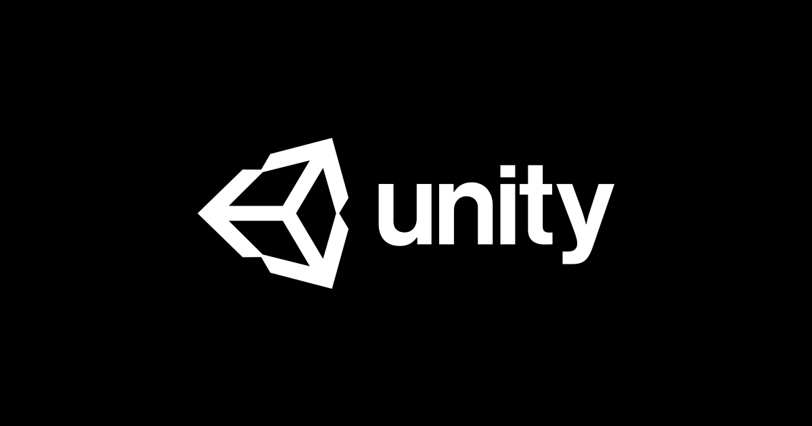

### Hi there, I'm Egor 👋

## I'm a Software Engineering student, who enjoys coding!

- 📚 I’m currently studying at Centennial College
- 👯 I’m looking to collaborate with other passionate developers.
- 🥅 2022 Goals: finish college, become more proficient in Unity and web development, learn React and other great technologies, meet new people and find my dream job!

### Languages and Tools:

